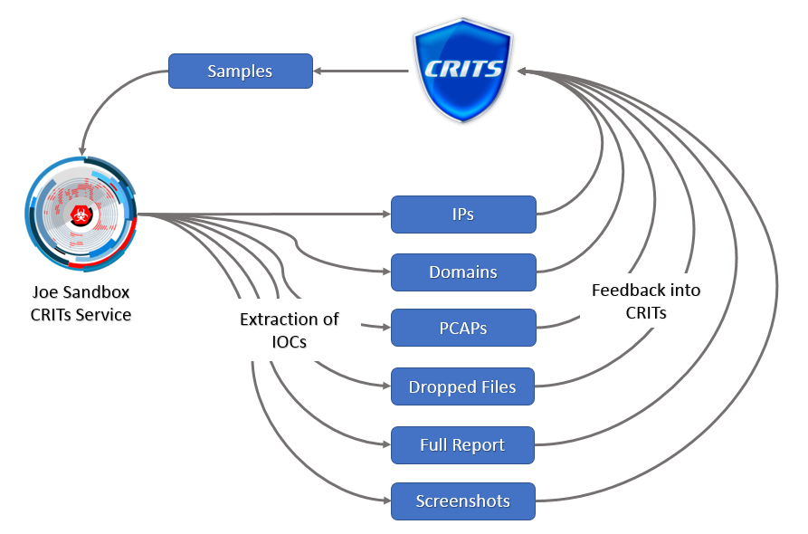
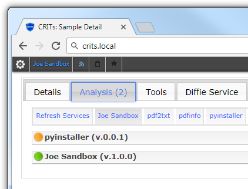

# Joe Sandbox CRITs

The Joe Sandbox CRITs service allows you to access the full power of Joe Sandbox
from inside [CRITs](https://crits.github.io/).

The service automatically extracts many IOCs from the sample and inserts them
automatically into CRITs enabling analysts to understand the connection between
multiple samples.

## Installation

(A more general description is available on the [CRITs github page](https://github.com/crits/crits/wiki/Adding-services-to-CRITs))

1. Clone this repository into `/data/joesandbox_crits`
2. Add this folder to your CRITs services.
3. run `bootstrap.sh` to install the dependencies.
4. Configure the service in the CRITs web interface.

